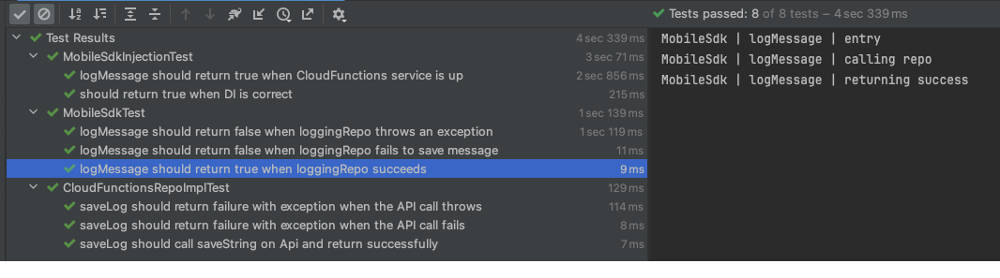
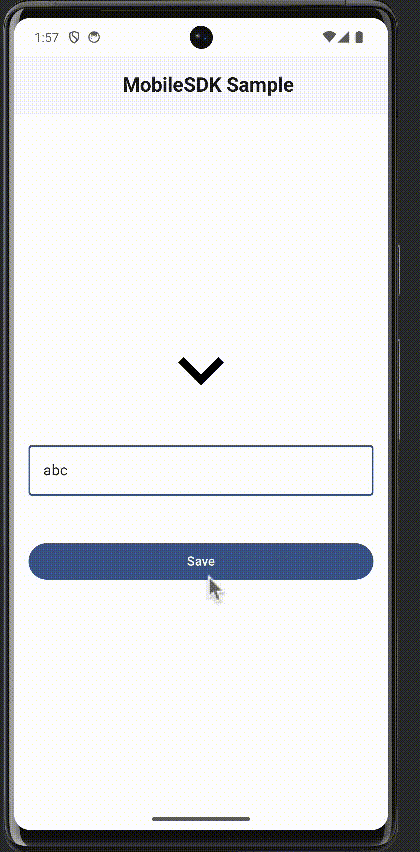
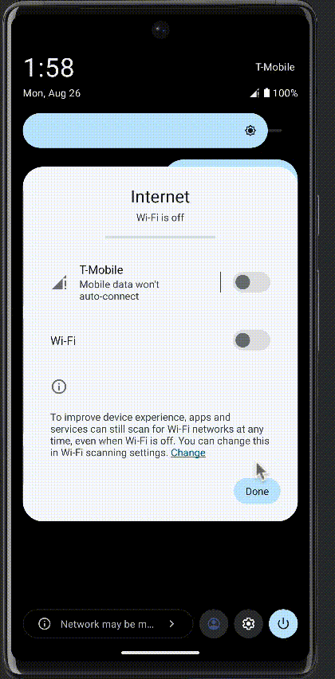
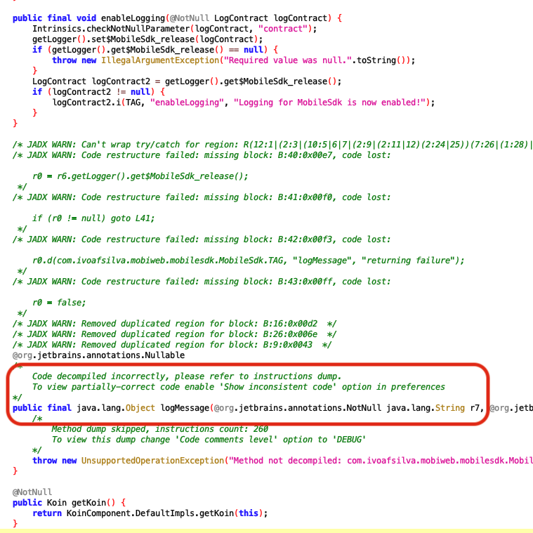
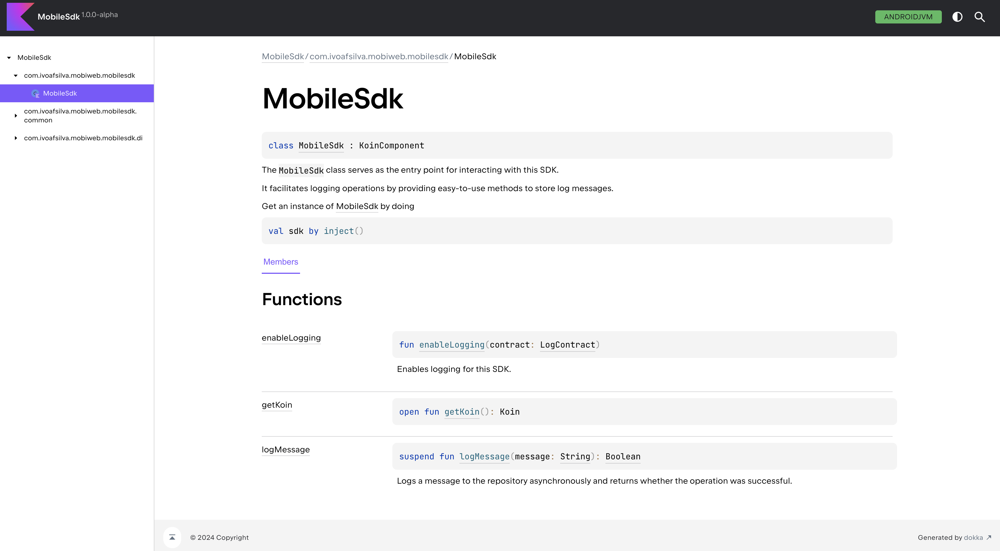

# Mobiweb Challenge

## Challenge consisting of developing...
- **A Mobile SDK**
- **A Sample Mobile Application** integrating the Mobile SDK

## Tech stack & Architecture

- 🏆 100% [Kotlin](https://kotlinlang.org/) + [Coroutines](https://github.com/Kotlin/kotlinx.coroutines) for asynchronous code. 🚀

### Mobile SDK

- AndroidX KTX
- Dependency Injection using [Koin](https://insert-koin.io/)
- [Retrofit](https://github.com/square/retrofit) and [OkHttp3](https://github.com/square/okhttp) for API requests
- [MockK](https://mockk.io/) for testing
- Simple but clean Architecture with layer separation and inversion of control

### Mobile Application Sample
- AAC
- Dependency Injection using [Koin](https://insert-koin.io/)
- JetPack
    - Compose       - Modern toolkit for building native UI.
    - Navigation    - Component that helps implementing and ensuring a consistent and predictable navigation.
    - ViewModel     - UI related controller/data holder, lifecycle aware.
- Architecture
    - Clean Architecture with layer separation and inversion of control
    - MVVM Architecture

## Features

### Mobile SDK

- Dependency Injection: Easily add or update how the info is stored.
- Logging: Both when testing and when being used by external applications.
- Obfuscation
- [SDK Documentation](./documentation/index.html)

### Mobile Application Sample

- Material Design 3 with DarkMode Support
- Request Animations
- i18n ready
- Very stable and scalable architecture allowing easy and quick feature-development

## Assumptions / Considerations:

- Doing an Android Library instead of a standalone Kotlin Library would be OK.
- Using Koin for Dependency Injection would be OK. 
- Only **One Entry Point** was wanted (a.k.a Singleton)
- Users of the Mobile SDK wanted to be aware of whether the request was successful.
	- This could be done through many ways: method return type, logging, callback, etc
	- I implemented two: callers can check the return value of the function and can log.

## Test Suite

|  |
|:--:|
| *Suite of completed unit tests* |

## Screenshots

|  |  |  |
|:--:|:--:|:--:|
| *Success Use-Case* | *Fail (No internet) Use-Case* | *Obfuscation* |

|  |
|:--:|
| *Documentation* |
